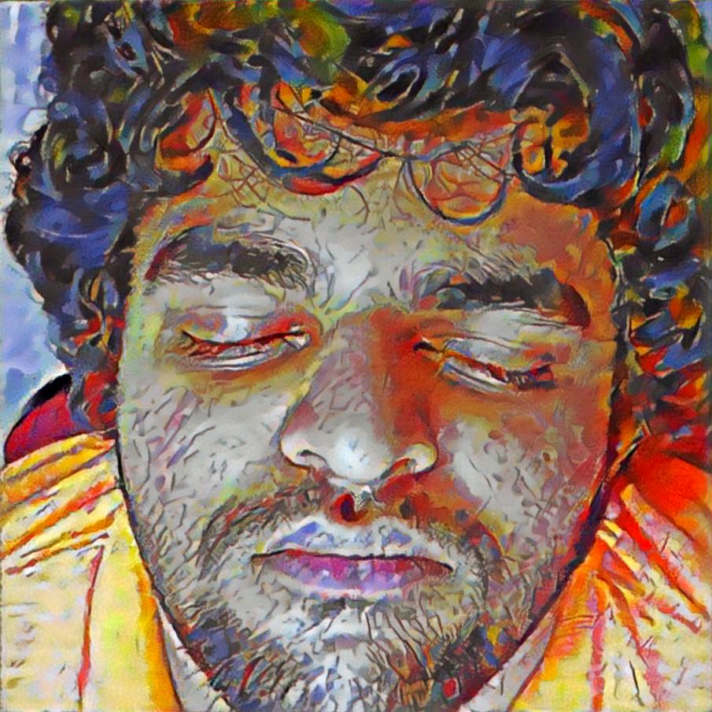
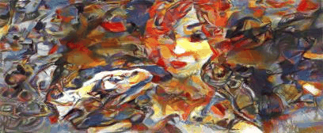

# Neural Style Transfer

This repository is an implementation of the research papers "[A Neural Algorithm of Artistic Style](https://arxiv.org/abs/1508.06576)" and "[Artistic style transfer for videos](https://arxiv.org/abs/1604.08610)", done as part of the CS337 project.

## Running Instructions

> **_NOTE:_** The code has been tested on `Ubuntu 18.04` with `Python 3.6.9` and `PyTorch 1.4.0`.

- Create a virtual environment using `python -m venv .`
- Run `source bin/activate`
- Install dependencies using `pip install -r requirements.txt`
- For video style transfer, put the video in `input/content/` and the style image in `input/style/`, add entries to the dictionary `abbrev_to_full` in `utils.py`.
- Run `python runner.py --videoname <video name> --stylename <stylename> --n_threads <number of parallel threads>`
- For image style transfer, update the path of the content and style images in `neural_style.py`, and then run `python neural_style.py`

> **_NOTE:_** `PyTorch` can be installed specific to the system configuration from [here](https://pytorch.org/get-started/locally/).

> **_NOTE:_** Before every run, it is advised to clear the caches using `bash clean.sh`

## Examples
### Image Style Transfer
- Tubingen + Van Gogh's Starry Night
    
- Taj Mahal + Picasso's Self Portrait
    
- JV Sleeping + Kandinsky's Composition 7
    
### Video Style Transfer
- Dragon + Kandinsky's Composition 7
    
- Pexel + Kandinsky's Composition 7
    